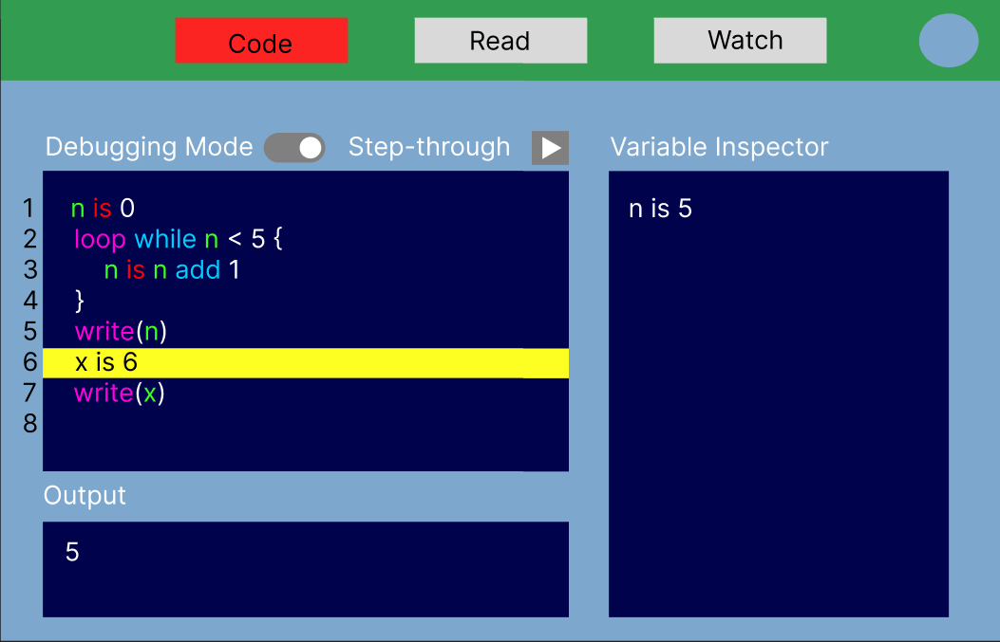

# School of Computing &mdash; Year 4 Project Proposal Form

## SECTION A

|                     |                       |
|---------------------|-----------------------|
|Project Title:       | START Web Application |
|Student 1 Name:      | Niall Kelly           |
|Student 1 ID:        | 20461772              |
|Student 2 Name:      | Adam Gray             |
|Student 2 ID:        | 20364103              |
|Project Supervisor:  | David Sinclair        |

## SECTION B

### Introduction

> Our project idea is to create a web application which will act as a learning experience for those new to computer programming. The site will utilise our programming language designed specifically for beginner programmers: START. It will provide coding tutorials as well as a built-in IDE (integrated development environment) with debugger which will allow users to learn about coding more effectively.

### Outline

> For this project we plan to create a Web Application using Python with Django and NodeJS, as well as CSS, HTML and some other JavaScript to help develop the front end of the application. This would consist of the following key features:

* Interactive Learning: Whether the user is a complete beginner or they have some coding experience, the START Web Application will offer a range of learning resources and tutorials tailored to their level. Step-by-step lessons and exercises ensure a smooth learning curve.

* Execution Environment: Executing START code right in the web application will be available to users, they will be able to witness the results of their code as they experiment and practice, gaining confidence and skills in real-time. More details on the integrated development environment can be found below.

> By implementing these core features it will allow for the best user experience as well as creating an interactive environment to help beginner programmers to learn programming fundamentals.

##### Integrated Development Environment

  
  Initial mockup of IDE design

> One of the core elements of our web app will be the IDE which will be able to execute our START language. The main focus with the IDE is to make coding as straight-forward, and clear as possible. The IDE will be language-sensitive; this means the code within the IDE will be highlighted in differing colours depending on the token's value. This should allow users to clearly identify differing words based on their roles. The IDE will also be able to highlight errors in real-time and suggest improvements. This should help the users grasp the language's intricacies effortlessly.

> The IDE will have a debugging option, which will allow code to execute slowly line by line. To ensure our debugger is friendly toward new users, the interface for debugging will be as limited and labelled as possible. Generally, keeping the interface of the IDE as bare bones as possible will ensure that new users are not overwhelmed by a clustered UI. The options for debugging will be kept to minimum. As seen above, ideally there will be two options; one to activate debugging mode and another to step through debugging to the next line. This will allow the user to see how the code is executed.

> Another feature included in the debugging option will be real-time variable inspection. This will be a window seperate to the IDE which will display information about the code being executed at its current stage of debugging. The information available will be current variable values, (recursion depth???), etc. This featured, paired with debugging mode, should allow the user to clearly see what is happening in the program while the code is executing.

### Background

> This project idea spawned from our 3rd year project idea to create our own programming language, and given our language is currently only available on GitHub, we wanted to make a more accessible to the average beginner programmer, who may have no previous experience with GitHub. Given this, we wanted to make one place where to user can go to learn and execute their code while using START.

> As well as this, we wanted to create a project that would allow us to put our learned experience from INTRA into practice given we both had experience working with small sections of web development. We now want to create our own full web application, creating our own front and back end, to give us the freedom to develop the final product as we disire, and not taylored to any customer/user specifications.

### Achievements

> The web app will provide the user with a comprehensive computer programming learning experience for people who are new to computer programming or have little experience in the subject, utilising our programming language designed specifically for beginner programmers: START. The website will include pages that include guides on how to use the language as well as other programming fundamentals. The site will also include a built-in IDE, which the user will be able to use to complete coding tasks. The IDE will include a debugger as well, as visual guides while debugging which will allow the user to visualise what is happening while their program is running.

### Justification

> The goal behind this web app project is to provide users, who are new to computer programming, a space in which they can get to know the basics of writing and running their own code. Based on our experience from 1st year computer programming, we feel that learning programming languages can be daunting for those with no prior experience. Our web app aims to fill in what we believe to be a large gap in the computer programming learning curve, between over-simplified "building block" style programming such as Scratch and actual programming languages such as Python. With the functionality discussed above, we feel this web app should provide a comprehensive introduction to computer programming for beginners. 

### Programming language(s)

* Python (DJango)
* JavaScript
* HTML
* CSS
* Some START elements may be used to simply design simple test questions and solutions for the application

### Programming tools / Tech stack

* Tech Stack: Python (Django), NodeJS, JavaScript, HTML, CSS
* Programming Tools: Visual Studio Code, GitLab, GitHub, Docker
* Other Tools: Figma, Notion, Google Drive

### Hardware

> N/A

### Learning Challenges

* Given our limited experience with Django web development from second year, and the small taste for web development we gained during our time in INTRA, we believe our biggest challenge now to be creating a fully functional web application with no guidence from either a lecturer or team lead, as well as the project not being driven by user or stakeholder requirements, but rather the requirements we feel the users will need to be able to learn programming fundamentals.

* Another challenge we will face, is the implementation of not just a language-sensitive IDE, but also a debugger, which will be a new challenge for us both, given we have no experience working with either in the past. It will be key that before we even write a single line of code, we do adequate research into how we can implement these features into our web application, looking at all possible options and choosing the best one for our project. 

* Once we have an IDE, we would need to implement a way for the user to execute their code, which will be another challenge for us, given we have no experience with this. We will need to research how we can implement this feature, possibly some form of contained environment, which will allow the user to execute their code, and see the results of their code in real time. If this is indeed the case Docker may be a good option for us to use, but given we have extremely limited experience with Docker, this will be another challenge for us to overcome, but will be key to the success of our project.

* The learning environment, while not being as inherently challenging as other features, will bring its own challenges, as we will need to balance how **we** as developers want the application to look, versus what the **user will want**. With enough time we would like to get user feedback and be able to make the necessary changes to the learning environment to make it as user friendly as possible, but given the time constraints of the project, this may not be possible, but will be something we will strive to achieve, again putting our time management skills to the test, in the most challenging way possible, and this could ultimately be the deciding factor in the success of our project.

* Finally this project will allow both of us to combine our love of low level programming from last years project, and bring it to the web, which will be a challenge in itself, given we have limited web development experience, but will be a challenge we are both looking forward to, and will be a great learning experience for us both for the future.

### Breakdown of work

#### Student 1

* Integration of START programming language into system
* Design language-sensitive IDE which can support the START langauge
* Design debugger for IDE 
* Primary implementer of backend using Python (Django), with some support work on frontend also
* Work on the core code behind the IDE and Debugger
* Work on the core code behind the learning resources
* Documentation of the project in all aspects

#### Student 2

* Designing the Figma mock-ups of the site, and the overall design of the site
* Implementing the Figma designs using CSS, HTML and JavaScript
* Primary implementer of frontend using JavaScript, with some support work on backend also
* Work on the core code behind the IDE and Debugger
* Work on the core code behind the learning resources
* Create user test cases to evaluate the sites usability
* Carry out user testing and feedback
* Documentation of the project in all aspects